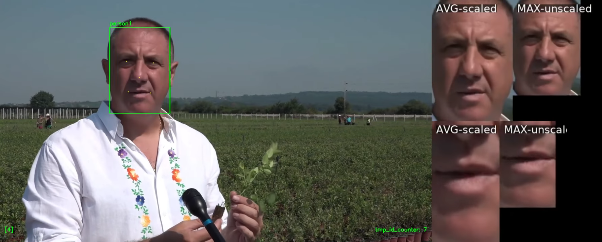

# VideoFace2.0
# Transforming faces into video stories

### Authors: Branko Brkljač $^{\text{§}}$, Vladimir Kalušev $^{\text{§}}$, Branislav Popović and Milan Sečujski

$^{\text{§}}$ equal contribution

 

 

## Abstract

Face detection and face recognition have been in the focus of vision community since the very beginnings. Inspired by the success of the original Videoface digitizer, a pioneering device that allowed users to capture video signals from any source, we have designed an advanced video analytics tool to efficiently create structured video stories, i.e. identity-based information catalogs. VideoFace2.0 is the name of the developed system for spatial and temporal localization of each unique face in the input video, i.e. face re-identification (ReID), which also allows their cataloging, characterization and creation of structured video outputs for later downstream tasks. Developed near real-time solution is primarily designed to be utilized in application scenarios involving TV production, media analysis, and as an efficient tool for creating large video datasets necessary for training machine learning (ML) models in challenging vision tasks such as lip reading and multimodal speech recognition. Conducted experiments confirm applicability of the proposed face ReID algorithm that is combining the concepts of face detection, face recognition and passive tracking-by-detection in order to achieve robust and efficient face ReID. The system is envisioned as a compact and modular extensions of the existing video production equipment. Presented results are based on test implementation that achieves between 18-25 fps on consumer type notebook. Ablation experiments also confirmed that the proposed algorithm brings relative gain in the reduction of number of false identities in the range of 73\%-93\%. We hope that the presented work and shared code will stimulate further interest in development of similar, application specific video analysis tools, and lower the entry barrier for production of high-quality multi-modal ML datasets in the future.

[**Original Videoface device**](https://en.wikipedia.org/wiki/Videoface)

####  For more information, please check our conference publication on the link below

Publication preprint available at: 

code TBA ...

___

✅ _Main characteristics include:_

* **Near real-time operation with ~ 18-25 fps** (consumer type notebook with GPU)

* **On-line or off-line processing mode** with different types of results visulaizations

🔍 * **Detailed log-file of face identities** found by the system. Suitable for video cataloging and spatial-temporal localization of each face image in which the same person appears

* **Fast post production of video stories** based on the results of video analysis stored in the corresponding log-file: single run of face ReID producing multiple outputs

* Modular and independent of the specific choice of methods for each of the components in _Algorithm&nbsp;1_ (face detection and face recognition models)

⚡ * Succesfully tested on **open-set face ReID in open-world** indoor and outdoor scenes 

___

✅ _Main applications include:_

* **TV production, media analysis and creative industries.**

⭐ * Production of custom **video-based datasets for machine learning (ML) tasks** involving multi-modal inputs like speech, text and image.

* Automated **video analysis and cataloging.**

⭐ * Production of **structured video outputs or video stories.**

🔨 * **Editing of interviews or reportages**, talk-shows, podcasts and other formats that include multiple speakers or participants.

___

 

## Video stories and VideoFace2.0 face ReID

### An example of the produced testVideo2 --> person30_video_story

- Input **testVideo2** that corresponds to the reportage brought by the field reporter to TV studio is **automatically processed** by **VideoFace2.0** and the shown video story corresponding to an unknown person identified by the system as "person30" is created. 

- Produced "person30" video story alongside extracted face and mouth region  videos (side-by-side visualization):  

▶️ [**testVideo2 --> "person30" + face + mouth region video stories**](https://youtu.be/StD026TDRLY?si=OnFwenHjcIWD61MC)

- All frames of the original input video in which the open-set face of the selected person appears are identified by the system and mixed together into the shown video story with synchronized audio.

- Original _testVideo2_ reportage: ["Vancouver Talks" - by @impsquared YouTube™ channel](https://www.youtube.com/watch?v=ixhZadXXABg).

- Produced video story also includes overlaid visualizations of face bounding boxes and face landmarks of all other persons that are present in the same frames in which the selected "person30" appears (other persons identified by the proposed face ReID procedure).

- **Produced video story**, download link: ▶️[**testVideo2-->person30_video_story**](./readmeFiles/testVideo2_person_video_story.mp4 "testVideo2_person_video_story").

- *more video examples are available on the corresponding links in the **Experimental results** section below.

 

### Other examples of video stories and VideoFace2.0 analyses:

 

&nbsp;&nbsp; 

&nbsp;&nbsp; **(a)** face region video story; 

&nbsp;&nbsp; 

&nbsp;&nbsp; **(b)** mouth region video story; 

&nbsp;&nbsp; 

&nbsp;&nbsp; **(c)** face identity mismatch;

&nbsp;&nbsp; 

&nbsp;&nbsp; **(d)** ablation experiments on _testVideo2_ (side-by-side visual comparison of 4 different algorithms);

&nbsp;&nbsp; 

&nbsp;&nbsp; **(e)** on screen presence of all 23 identities found by VideoFace2.0 in _testVideo2_ in case of full _Algorithm&nbsp;1_ - the proposed face ReID procedure corresponding to the the best face ReID result shown in the lower right part of abalation experiments visualization in **(d)**.

### Proposed generic face ReID procedure:

&nbsp;&nbsp; 

___

 

## Table&nbsp;1 - Summary of ablation experiments

### Reduction of false identities brought by _Algorithm&nbsp;1_ (relative gain $\gamma$)

---
| \# Number of found identities | exp 1 | exp 2 | exp 3 | exp 4 | true | $\gamma$ [%] | [m:s]  |
|-------------|-------|-------|-------|-------|------|-------|--------|
| testvideo1  | 50    | 42    | 30    | 7     | 4    | 83    | 02:44  |
| testvideo2  | 421   | 378   | 263   | 23    | 13   | 93    | 07:25  |
| testvideo3  | 39    | 37    | 25    | 9     | 6    | 73    | 18:45  |

---

**Table&nbsp;1 notes:**

- $\exp i$, $i=1..4$, ablation experiments

- $\gamma$, relative gain of _Algorithm&nbsp;1_ in terms of number of found identities in comaprison to other experiments, calculated as:  
  $\gamma = (1- \exp4 /(\sum_{i=1}^{3}(\exp_i)/3))\times 100\%$

- exp 1: detection + recognition; 

- exp 2: detection + recognition + passive tracker filtering of new identities

- exp 2: detection + recognition + passive tracker filtering of new identities + detection confidence score

- exp 4 (full _Algorithm&nbsp;1_): detection + recognition + passive tracker filtering of new identities + detection confidence score + temporal post filtering
 
- "true", expected or true number of unique identities in each video. Number of distinct faces that are expected to be found by the system. Does not mean that these faces have significant on screen presence.
 
- [m:s] indicates duration in minutes and seconds.

___

 

# Experimental results:

Video demonstrations of VideoFace2.0 functionalities are available on the following YouTube™ channel:

### [https://www.youtube.com/@kalusev](https://youtube.com/playlist?list=PLrYDQtLBCliyMwlyNJ62EtHiQYDiPxZlH&si=83qGT1-tJw4sAYx-)

- Presented experiments include 3 specific test videos with challenging face ReID situations and scene environments characteristic for the above mentioned application scenarios.

In the following are image previews and individual YouTube™ links of some of the conducted experiments.

 

___
## testVideo1

• **Face ReID results** based on full _Algorithm&nbsp;1_ with parameters set to: $\sigma_h=0.6$, $\tau_d=0.6$, $\tau=0.8$, and $t_{min}=60$ frames*:

&nbsp;&nbsp; ▶️[**testVideo1 face ReID results**](https://youtu.be/k_Jd-Xw4mDA?si=C-tikv-_U1D-dAPG)

&nbsp;&nbsp; 

 

• **Face ReID ablation experiments**, side-by-side comparison:

&nbsp;&nbsp; ▶️[**testVideo1 face ReID ablation experiments**](https://youtu.be/Xpwi_22ckrs?si=3VxzqYYFsnEGvwl-)

&nbsp;&nbsp; 

&nbsp;&nbsp; Experiments are numbered 1-4 and consist of:
 
&nbsp;&nbsp;&nbsp;&nbsp; 1. **Upper left:** detection + recognition (exp 1)

&nbsp;&nbsp;&nbsp;&nbsp; 2. **Upper right:** detection + recognition + passive tracker filtering of new identities (exp 2)

&nbsp;&nbsp;&nbsp;&nbsp; 3. **Lower left:** detection + recognition + passive tracker filtering of new identities + detection confidence score (exp 3)

&nbsp;&nbsp;&nbsp;&nbsp; 4. **Lower right:** detection + recognition + passive tracker filtering of new identities + detection confidence score + temporal post filtering (proposed full _Algorithm&nbsp;1_, exp 4)

&nbsp;&nbsp; $^{\text{*}}$ Note that the introduced $t_{min}$ delay in new identity approval only affects initial appearance of new identities, but does not affect ReID of the identities already present in the gallery (real-time operation after the new identity is approved as valid). Therefore, it could be replaced by a more complex ReID decision rule, which would have the same role as the introduced post filtering. In case of the need for immediate appearance of new identities in real-time operation, $t_{min} \approx 0$ should be used.

 

• **Face video story:**

&nbsp;&nbsp; ▶️[**testVideo1 face video story**](https://youtu.be/4kBuSA_oQH0?si=PGRFIqIjZq-gQ3mS)

&nbsp;&nbsp; 

 

• **Mouth region video story:**

&nbsp;&nbsp; ▶️[**testVideo1 mouth region video story**](https://youtu.be/cdTt1KRJ4v0?si=L9O8wuHyRJitSI8E)

&nbsp;&nbsp; 

___
 

## testVideo2

• **Face ReID results** based on full _Algorithm&nbsp;1_ (with same set of parameters as for _testVideo1_):

&nbsp;&nbsp; ▶️[**testVideo2 face ReID results**](https://youtu.be/h_tM-7HUlXc?si=aAnjR6Cu4mhQX5Jz)

&nbsp;&nbsp; 

 

• **Face ReID results together with face and mouth region extraction** (side-by-side) for the selected person identified as "person30":
 

&nbsp;&nbsp; ▶️[**testVideo2 person30 face ReID with face and mouth region extraction**](https://youtu.be/StD026TDRLY?si=OnFwenHjcIWD61MC)

&nbsp;&nbsp; 

&nbsp;&nbsp; Video consists of 3 parts:

&nbsp;&nbsp; **1. Left side:** Face re-identification (ReID) results.

&nbsp;&nbsp; &nbsp;&nbsp; Video shows all persons that have been identified as present together (in the same frame) with the selected "person30": their bounding boxes, person IDs and face landmark points.  

&nbsp;&nbsp; **2. Top right:** Zoomed-in face image regions for the selected person.

&nbsp;&nbsp; &nbsp;&nbsp; Video part contains face images of "person30" cropped to face detection bounding box and:

  &nbsp;&nbsp; &nbsp;&nbsp; * AVG-scaled: Scaled to average width and height of face ROI over all frames in which "person30" appears (non-uniform scaling): face image on the left

  &nbsp;&nbsp; &nbsp;&nbsp; * MAX-scaled: Face image is only positioned next to the AVG-scaled version (original image without scaling). Shown face video dimensions correspond to face appearance with maximum width and height in the original video.
  

 

&nbsp;&nbsp; **3. Bottom right:** Mouth region extraction for the selected person.

&nbsp;&nbsp; &nbsp;&nbsp; Video part interpretation is the same as in the case of face image regions described in the previous point 2.

 

• **Face ReID ablation experiments**, side-by-side comparison:

&nbsp;&nbsp; ▶️[**testVideo2 face ReID ablation experiments**](https://youtu.be/QCB-hkVFjjY?si=cu6zjae_ClA_jZ7P)

&nbsp;&nbsp; 

___

 

## testVideo3

• **Face ReID results** (with same set of parameters as for _testVideo1_):

&nbsp;&nbsp; ▶️[**testVideo3 face ReID results**](https://youtu.be/dI42b5R1mWo?si=8VJ4kkA3XrAtPH20)

&nbsp;&nbsp; 

 

• **Face re-identification results together with landmark points, face and mouth region extraction** (side-by-side) for the selected person identified as "person1":

▶️ [**testVideo3 --> "person1" video story**](https://youtu.be/KsNaId9Au80?si=f-6y25JP89Ia_Pwf)

 

 

• **Face ReID ablation experiments**, side-by-side comparison:

&nbsp;&nbsp; ▶️[**testVideo3 face ReID ablation experiments**](https://youtu.be/wQZrI2MP7Zo?si=t4AWy4ym6KvoHCSK)

&nbsp;&nbsp; 

 

___

 

## Licenses:

Original _testVideo2_ and _testVideo3_ are avaialble on the following links under the [YouTube™'s "Creative Commons Attribution license (reuse allowed)"](https://www.youtube.com/t/creative_commons):

- Original _testVideo2_: ["Vancouver Talks" - by @impsquared YouTube™ channel](https://www.youtube.com/watch?v=ixhZadXXABg).

- Original _testVideo3_: ["Reportaža Superior Velika Plana" - by @tvpirotpirot8451 YouTube™ channel](https://youtu.be/lIy9imwyMv4?si=m0p3RknosjxPQTRv).

Presented implementation and experimental results are based on the pre-trained face detection and face recognition models kindly provided by the [InsightFace project](https://github.com/deepinsight/insightface) - State-of-the-art 2D and 3D face analysis.
  
VideoFace2.0 is released under the MIT License terms in the provided LICENSE file.

___

 

## How to cite:

[1] *Brkljač, B., Kalušev, V., Popović, B., Sečujski, M.* (**2025**). **Transforming faces into video stories - VideoFace2.0**. In _Preprint submitted to the 14th Mediterranean Conference on Embedded Computing - MECO 2025_, Budva, Montenegro, 10-14 June, 2025

<pre><code>
    @inproceedings{brkljacVideoface2025,
    author = {Brklja{\v{c}}, Branko and Kalu{\v{s}}ev, Vladimir and Popovi{\'c}, Branislav and Se{\v{c}}ujski, Milan},
    title = {Transforming faces into video stories - {VideoFace2.0}},
    booktitle = {Preprint submitted to the 14\textsuperscript{th} Mediterranean Conference on Embedded Computing (MECO), Budva, Montenegro},
    volume = {1},
    pages = {1--4},   
    month = {10--14 June},
    year = {2025},
    doi = {-}
    }
</code></pre>

[2] Brkljač, B., Kalušev, V., Popović, B., Sečujski, M. (**2025**). **Transforming faces into video stories - VideoFace2.0**. arXiv preprint [**arXiv:2505.02060**](https://arxiv.org/abs/2505.02060)

<pre><code>
      @misc{brkljac2025transformingfacesvideostories,
      title={Transforming faces into video stories - VideoFace2.0}, 
      author={Branko Brkljač and Vladimir Kalušev and Branislav Popović and Milan Sečujski},
      year={2025},
      eprint={2505.02060},
      archivePrefix={arXiv},
      primaryClass={cs.CV},
      url={https://arxiv.org/abs/2505.02060},
      doi={10.48550/arXiv.2505.02060} 	  
}
</code></pre>

 

